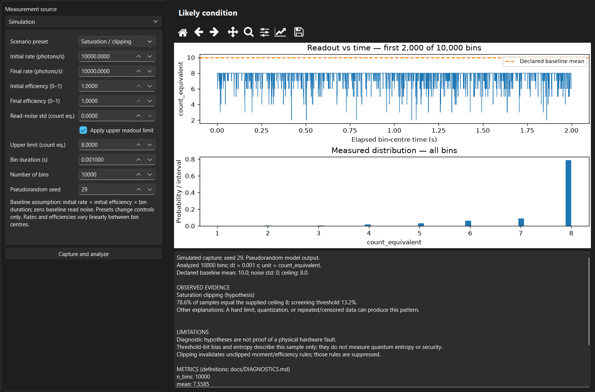
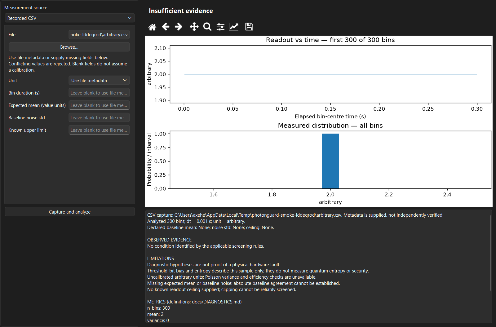
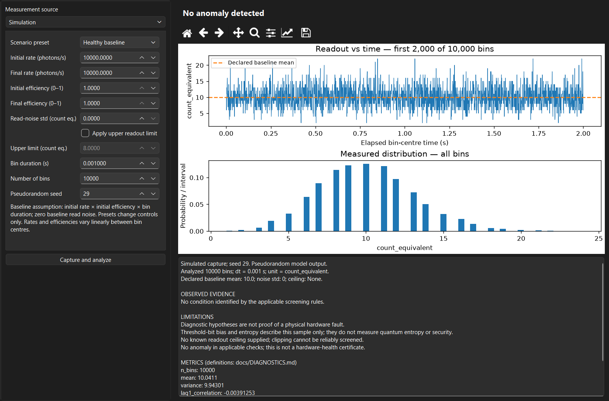

# PhotonGuard V1.1

PhotonGuard is an open-source, Windows-first desktop tool for simulating photon
counting and screening detector measurements for abnormal behaviour. It accepts
seeded simulations and recorded CSV captures through the same interpretable
analysis engine.

It suggests **possible conditions with evidence and competing explanations**.
It does not prove a hardware fault, measure physical quantum entropy, certify
calibration, or validate a production QRNG or cryptographic security.



## What it does

- Constant-rate coherent-light Poisson counting and an ideal detector baseline.
- Binomial detection efficiency, additive electronic noise and hard upper clipping.
- Reproducible source drift and efficiency-degradation scenarios.
- Mean/variance, ceiling occupancy, temporal change, lag-one correlation and
  descriptive threshold-bit bias/entropy, with explicit applicability limits.
- Qualified hypotheses for clipping and increased electronic noise; ambiguity
  between source dimming and efficiency loss; insufficient-evidence handling.
- PySide6/Qt controls, simulation/CSV selection, interactive plots and an evidence panel.
- A documented `read() -> Measurement` adapter boundary. **No live drivers.**

The product boundary is [Project Scope v1.1](PhotonGuard_Project_Scope_v1.1.docx).
There is no QKD, encryption demonstration, ML classifier, cloud service, account
system, web/mobile app or custom hardware.

## Install and run on Windows

From a checkout, use PowerShell. Python 3.10+ is declared supported; the verified
release environment is Windows x64 / Python 3.12.10. Other Python/OS combinations
have not been validated.

```powershell
git clone https://github.com/AxeH666/PhotonGuard.git
cd PhotonGuard
py -3.12 -m venv .venv
.\.venv\Scripts\python.exe -m pip install -e ".[gui,test]"
.\.venv\Scripts\python.exe -m photonguard
```

The core requires NumPy. The desktop uses Matplotlib and PySide6-Essentials
(Qt Core/Gui/Widgets; no unused Qt add-ons). Tests use pytest; packaging uses
PyInstaller. There is no SciPy dependency. For the exact tested dependency
snapshot, install `requirements-windows.txt` before the editable project.

Choose a simulation preset and **Capture and analyze**. Presets remain editable.
For recorded data, select **Recorded CSV**, browse to the file and supply missing
metadata if necessary. `examples/data/synthetic_counts.csv` is a small **synthetic**
example, not a laboratory recording. No calibration or units are guessed.



See [desktop controls and plot interpretation](docs/DESKTOP.md) and
[the strict CSV format](docs/CSV.md). The time plot shows the first 2,000 bins;
the distribution and diagnostics use the full capture. Toolbar buttons pan,
zoom, reset and save the displayed figure. Results describe the completed
capture, not subsequent control edits.

## Physics and interpretation

For integration time `dt` seconds and incident rate `r_i` photons/s:

```text
Incident counts:  N_i ~ Poisson(r_i * dt)
Detected counts:  K_i | N_i ~ Binomial(N_i, eta_i)
Readout:          X_i = K_i + Normal(0, sigma_e**2)
Upper clipping:   Y_i = min(X_i, L)   (when enabled)
```

`eta_i` is dimensionless efficiency. Read noise and clipping use normalized
photon-equivalent readout units, not arbitrary volts or ADC values. With constant
parameters and no clipping, `E[X] = eta*r*dt` and
`Var(X) = eta*r*dt + sigma_e**2`. Variance has squared value units. The ideal
baseline has `eta=1`, no electronic noise, and no clipping, so mean and variance
are numerically equal.

A lower mean alone cannot distinguish source dimming, optical loss and reduced
efficiency. Unknown ceiling means clipping cannot be reliably screened. Arbitrary
recorded units do not permit Poisson/efficiency conclusions without calibration.
No anomaly means only that applicable screening checks found none.

Read [equations, assumptions and limitations](docs/PHYSICS.md),
[every diagnostic rule and threshold](docs/DIAGNOSTICS.md), and
[validation and acceptance evidence](docs/VALIDATION.md). Software pseudorandom
sampling demonstrates a chosen model; it does not establish physical quantum
randomness. Dark counts, dead time, afterpulsing, non-Poisson illumination, analog
transfer functions and laboratory calibration are not implemented.

## Reproduce the checks and examples

```powershell
.\.venv\Scripts\python.exe -m pytest -q
.\.venv\Scripts\pytest.exe -q
.\.venv\Scripts\python.exe examples\baseline_plots.py --output-dir outputs\baseline
.\.venv\Scripts\python.exe examples\scenarios.py --output-dir outputs\scenarios
.\.venv\Scripts\python.exe -m photonguard.smoke outputs\native-smoke
```

The PR1 example (seed `20260924`) writes independent `counts_vs_time.png` and
`photon_count_distribution.png` files. The scenario example (seed `29`) writes
five synthetic CSV captures and `reports.json`. Re-importing those CSVs produces
the same diagnostics. Example commands replace matching output filenames.
Generated output is ignored by Git. Exact streams are only repeatable within a
compatible dependency environment.

GUI tests use Qt offscreen by default and are skipped explicitly if Qt is not
installed. A full release check must install the GUI extra and have no skips.
The native smoke command exercises the actual Windows Qt platform separately.
Its screenshots include the healthy baseline:



## Project structure

| File | Responsibility |
| --- | --- |
| `baseline.py` | Constant-rate Poisson source and ideal detector |
| `detector.py` | Detection efficiency, noise, clipping and rate/efficiency profiles |
| `measurement.py` | Validated observed values and declared metadata |
| `diagnostics.py` | Source-independent metrics, rules, evidence and ambiguity |
| `csv_input.py` | Strict recorded-data parsing and metadata validation |
| `sources.py` | Simulation/CSV adapters implementing one finite `read()` |
| `gui.py` | Desktop controls, worker, plots and diagnostic presentation |
| `examples/`, `tests/`, `docs/` | Reproducibility, verification and interpretation |

Package modules are under `src/photonguard/`. The
[adapter contract and example stub](docs/ADAPTERS.md) explain how future
Serial/COM, USB, DAQ, oscilloscope, TCP/IP or vendor-SDK adapters could provide
captures without changing diagnostics. No device compatibility is claimed.

## Windows executable and license

See [build instructions and native validation](docs/RELEASE.md). The portable
one-directory build contains `PhotonGuard.exe`; keep its companion files together.
No separate Python installation is needed to launch a successful frozen build.
There is no installer or code signing. Build/validation results and remaining
platform limits are recorded in [VALIDATION.md](docs/VALIDATION.md).

PhotonGuard source is [MIT-licensed](LICENSE). Qt/PySide and other dependencies
retain their own licenses; see [third-party notices](THIRD_PARTY_NOTICES.md).
The founder's independent review of the completed implementation remains separate
from the per-PR self-reviews used during this authorized completion run.
